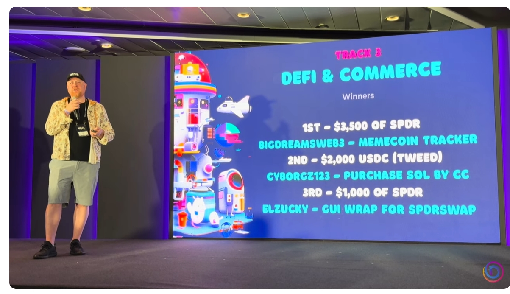

# MemeCoinTracker 🎉  

**Winner of the $3,500 Prize in the DSCVR Canvas Bounty on Dora Hacks!**  

## Introduction  
MemeCoinTracker is a modern and visually appealing web application built with **LitElement** and **Vite.js**, designed to track meme coins. This project showcases advanced functionality for searching, analyzing, and interacting with meme coin data. It was recognized during the [DSCVR Canvas Bounty Closing Ceremony](https://youtu.be/aTrYfaXhtvc?si=z-aE_l0p721uSbMw) and awarded **$3,500** for its innovative approach and design.

---

## Features  
### 🌟 **Real-Time Data**  
- Fetches and displays meme coin details from **CoinGecko API**.  
- Data includes price, market cap, volume, and percentage changes.

### 🔍 **Search Functionality**  
- Seamless searching of meme coins by name.  

### 📱 **Responsive Design**  
- Optimized for devices of all sizes, ensuring a smooth user experience.  

### 🎨 **Animated Transitions**  
- Interactive coin details with smooth reveal animations.  

### ➕ **Load More Functionality**  
- Allows users to view more coins dynamically.

---

## Technologies Used  
- **LitElement:** For creating dynamic web components and enhancing user interfaces.  
- **Vite.js:** Fast build times and efficient hot module replacement during development.  
- **CoinGecko API:** Fetching up-to-date meme coin market data.  

---

## Setup  
### 1️⃣ Clone the repository:  
```bash
git clone https://github.com/italiancode/memecointracker.git
```  

### 2️⃣ Navigate to the project directory:  
```bash
cd memecointracker
```  

### 3️⃣ Install dependencies:  
```bash
npm install
```  

### 4️⃣ Start the development server:  
```bash
npm run dev
```  

---

## Screenshots  
_**[Add a few images or GIFs demonstrating the app here!]**_  

---

## Award Announcement  
MemeCoinTracker was awarded **$3,500** during the [DSCVR Canvas Buildathon Closing Ceremony](https://youtu.be/aTrYfaXhtvc?si=z-aE_l0p721uSbMw), where it was presented under the project name **BigDreamsWeb3 - MemeCoinTracker**.

  

---

## Acknowledgements

This project was created for the [DSCVR Canvas Bounty](https://dscvr.one/) and awarded $3,500 during the competition hosted by [Dora Hacks](https://dorahacks.io/).

Special thanks to the DSCVR team for organizing the event and supporting innovative projects in Web3!


## Contribution  
We welcome contributions to enhance the features of MemeCoinTracker. Please feel free to fork the repository and submit a pull request.  

---
